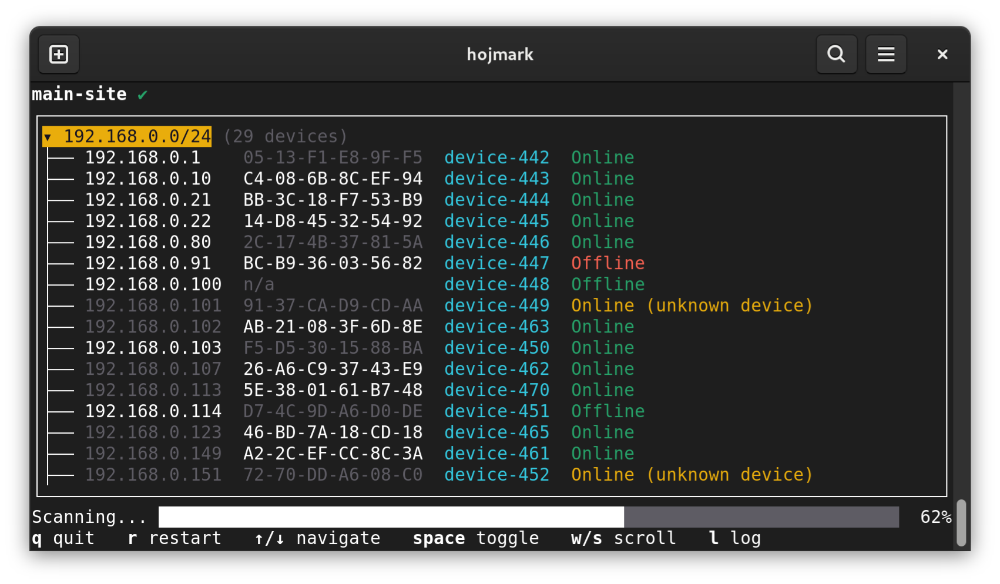

# Drift CLI

> 🧪 **Alpha**  
> Things are still being wired together. Your feedback helps!

Drift is a command-line tool that gives you confidence to change your network configuration and firewall rules, knowing
you’ll be alerted if your network drifts from its desired state. By comparing the actual network state to your declared
state, Drift can detect issues like unknown devices or unexpected subnet access, helping you maintain network integrity.


---



## Getting started

### Linux 🐧

#### Install

You can install Drift by either:

- Downloading the latest release from
  the [Releases page](https://github.com/hojmark/drift/releases?q=prerelease%3Afalse), or
- Running the installation script:

    ```bash
    curl -sSL https://raw.githubusercontent.com/hojmark/drift/refs/heads/main/install.sh | bash
    ```

  ℹ️ **What does the script do?**  
  It fetches the latest version, and puts `drift` into `/usr/local/bin`.
  If Drift is already installed, it will be updated to the latest version.
  For more info see [Installation Options - Script](./README_dev.md#script-installsh),
  or [view the source code](./install.sh).

#### Run

```bash
# Create a network spec using auto-discovery
drift init

# Scan and detect drift
drift scan -i
```

### Windows 🪟

#### Install

You can install Drift by either:

- Downloading the latest release from
  the [Releases page](https://github.com/hojmark/drift/releases?q=prerelease%3Afalse), or
- Running the installation script in PowerShell:

    ```powershell
    irm https://raw.githubusercontent.com/hojmark/drift/refs/heads/main/install.ps1 | iex
    ```

  ℹ️ **What does the script do?**  
  It fetches the latest version, extracts `drift.exe` to `%LOCALAPPDATA%\Programs\drift`, and adds that directory to
  your user `PATH` automatically.
  If Drift is already installed, it will be updated to the latest version.
  For more info see [Installation Options - Script](./README_dev.md#script-installps1),
  or [view the source code](./install.ps1).

#### Run

```powershell
# Create a network spec using auto-discovery
drift init

# Scan and detect drift
drift scan -i
```

### Container

#### Run

```bash
# Scan host network
docker run -it --rm --network host docker.io/hojmark/drift scan -i
```

## 🌟 Features

- 🕵️ **Drift Detection**  
  Detect mismatches between your declared and actual network state.

- 📄 **Declarative**  
  Define your intended state in YAML. Generate a spec from your live network to get started quickly.

- 📡 **Network Discovery**  
  Automatically detect devices and services, then use that information to define your desired state.
  Discover IP addresses, MAC addresses, and open ports.

- 🧱 **Subnet Access Detection** _(coming soon)_  
  Detects whether access between subnets is possible, highlighting potential firewall rule issues.

- 📦 **CLI**  
  Manage everything from the command line — interactively or in scripts — with multiple output formats.

- 🌍 **Distributed Scanning** _(coming soon)_  
  Deploy agents across subnets for complete network visibility.

- 🔁 **Continuous Monitoring** _(coming soon)_  
  Automate scans and receive alerts when drift is detected.

- 🛜 **Wi-Fi Scanning** _(coming soon)_  
  Detect Wi-Fi networks and their properties — including SSID, BSSID, signal strength, and
  encryption type — and use that information to define your desired state.

## ❓ FAQ

### ▸ Is there any documentation?

Use `--help` on each command to explore functionality.

A user settings file can be created at `~/.config/drift/settings.json`.

JSON Schemas are available to enable editor auto-completion and validation:

- [**Network spec schema**](https://raw.githubusercontent.com/hojmark/drift/refs/heads/main/src/Spec/embedded_resources/schemas/drift-spec-v1-preview.schema.json)  
  Add the `yaml-language-server` comment at the top of your spec file:
  ```yaml
  # yaml-language-server: $schema=https://raw.githubusercontent.com/hojmark/drift/refs/heads/main/src/Spec/embedded_resources/schemas/drift-spec-v1-preview.schema.json
  network:
  ...
  ```
- [**User settings schema**](https://raw.githubusercontent.com/hojmark/drift/refs/heads/main/src/Cli.Settings/embedded_resources/schemas/drift-settings-v1-preview.schema.json)  
  Add the `$schema` property at the top of your settings file:
  ```json
  {
    "$schema": "https://raw.githubusercontent.com/hojmark/drift/refs/heads/main/src/Cli.Settings/embedded_resources/schemas/drift-settings-v1-preview.schema.json",
    ...
  }
  ```

There’s no official documentation site yet — if you run into trouble, feel free
to [open a discussion](https://github.com/hojmark/drift/discussions/categories/q-a).

### ▸ What can be automatically discovered?

Drift can automatically discover devices (MAC, IPv4, hostname), open ports, and subnets. Due to the massive size of the
IPv6 address space, full IPv6 scanning isn’t feasible. However, you can still manually define IPv6 addresses for your
known devices.

### ▸ Is this useful for: _my homelab_?

Yes! That’s exactly what I built it for. I'd love your feedback if you think anything could be improved. Being in alpha,
I'm sure there's quite a bit!

### ▸ Is this useful for: _a business environment_?

Probably! But I’d love to hear what you think.

**Heads-up:** make sure it's okay that you scan your company's network — it could trigger intrusion detection systems.

### ▸ I’d really like feature X!

Awesome! Please [open an issue](https://github.com/hojmark/drift/issues/new/choose) and I’ll make sure to consider it.

### ▸ I think I found a bug?

Oops! Mind [opening an issue](https://github.com/hojmark/drift/issues/new/choose), so I can take a look?
